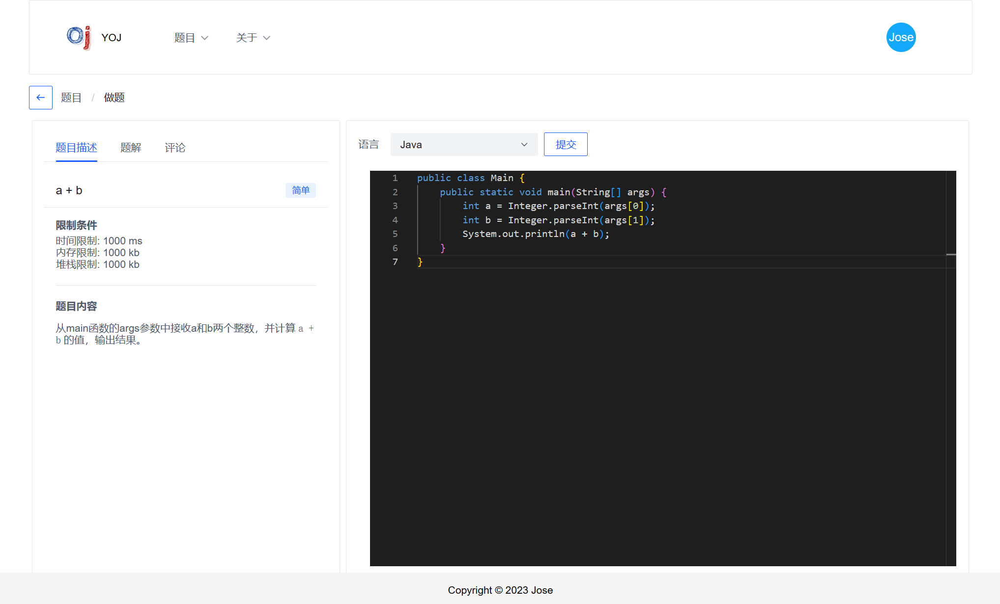
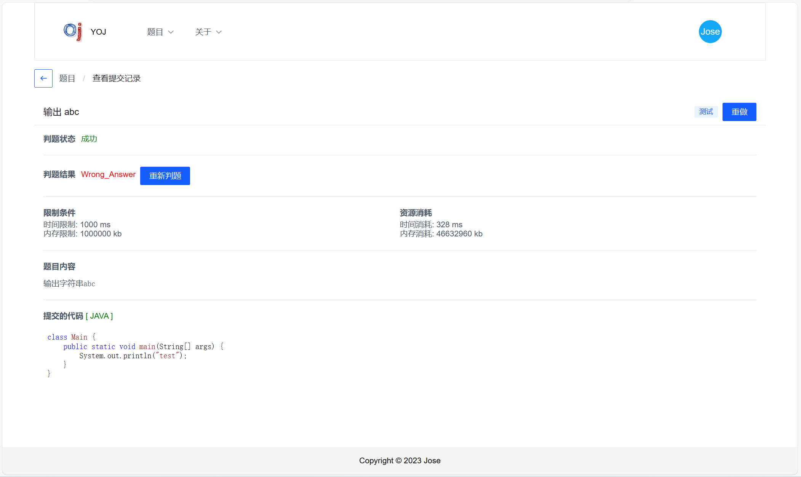
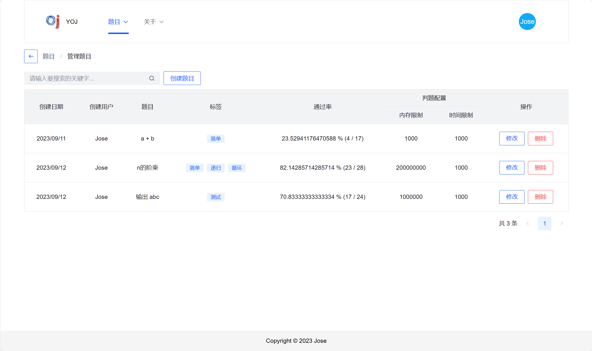
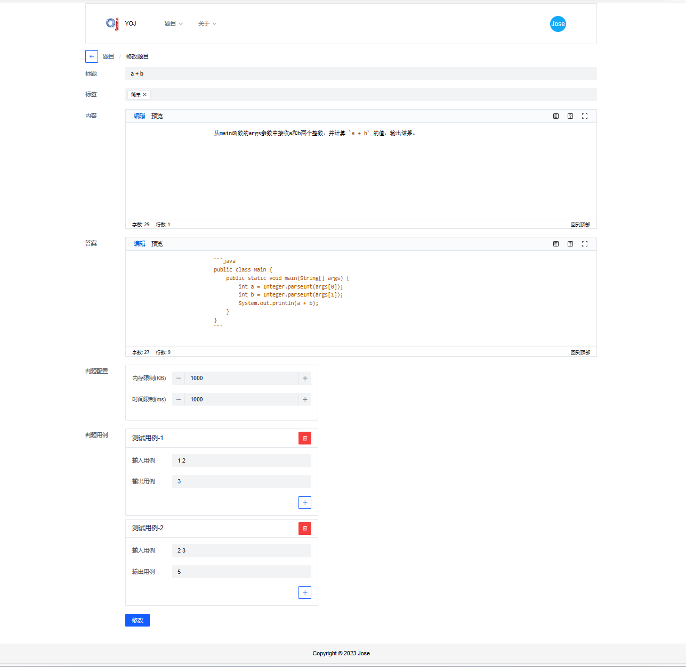

## YOJ 系统

### 项目简介

> 该项目实现了一个在线的编程语言判题系统。应用分为两种形式：单体应用和SpringCloud微服务。
>
> 项目中单独实现了编译代码的代码沙箱功能。

### 演示地址

[http://valleys.nat300.top](http://valleys.nat300.top)

> 用户名:  Admin
>
> 密    码: 12345678

### 效果展示

1. 登录

   

2. 浏览题目

   

3. 做题

   

4. 提交记录列表

   

5. 查看提交记录

   

6. 管理题目列表

   

7. 修改题目

   